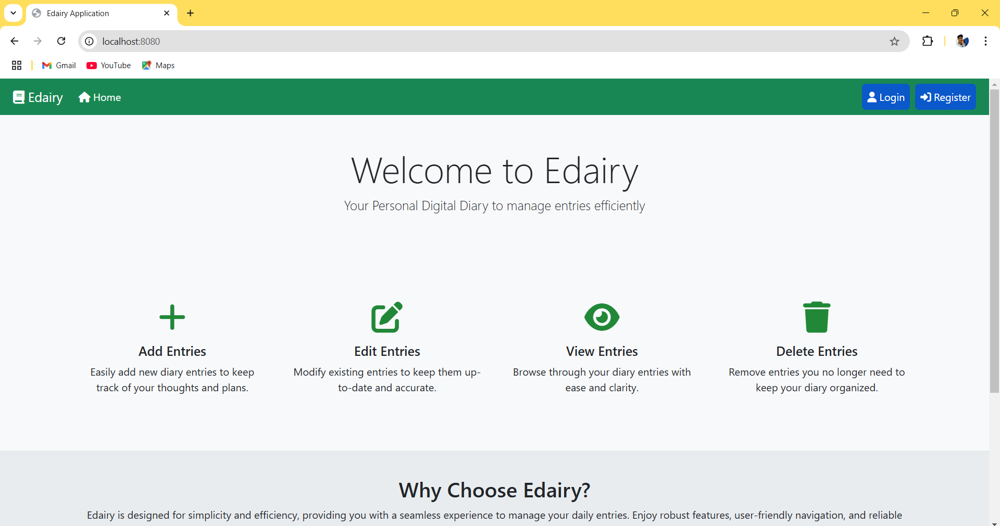

<h1 align="center">📒 eDiary Application</h1>

    The <strong>eDiary Application</strong> is a feature-rich digital diary system developed using <strong>HTML</strong>, <strong>CSS</strong>, <strong>JavaScript</strong>, <strong>Spring Boot</strong>, <strong>Spring MVC</strong>, <strong>Spring Data JPA</strong>, and <strong>MySQL Database</strong>. It allows users to securely manage their personal diary entries while also providing advanced user account management functionalities.

<h2>🚀 Features</h2>

<h3>👤 User Management</h3>
<ul>
    <li><strong>User Registration:</strong> Store user details securely in the database upon successful registration.</li>
    <li><strong>Login:</strong> Log in to the application with valid credentials.</li>
    <li><strong>Forgot Password:</strong> Reset password using registered <strong>email</strong> and <strong>mobile number</strong>.</li>
    <li><strong>Profile Management:</strong>
        <ul>
            <li>View profile details.</li>
            <li>Update user information.</li>
            <li>Permanently delete user account.</li>
        </ul>
    </li>
</ul>

<h3>📔 Diary Management</h3>
<ul>
    <li><strong>Add Entry:</strong> Create a new diary entry.</li>
    <li><strong>Update Entry:</strong> Edit an existing diary entry.</li>
    <li><strong>View Entries:</strong> View all or specific diary entries.</li>
    <li><strong>Remove Entry:</strong> Delete individual diary entries.</li>
</ul>

<h2>🛠️ Technologies Used</h2>
<ul>
    <li><strong>Frontend:</strong> HTML, CSS, JavaScript</li>
    <li><strong>Backend:</strong> Spring Boot, Spring MVC, Spring Data JPA</li>
    <li><strong>Database:</strong> MySQL</li>
</ul>

<h2>📁 Project Structure</h2>
<pre>
src/
├── model/             
│   Contains POJO classes annotated with JPA for mapping database tables.
├── repository/        
│   Includes interfaces for database operations using Spring Data JPA.
├── service/           
│   Handles business logic and acts as a bridge between controller and repository layers.
├── controller/        
│   Manages HTTP requests, invokes services, and returns appropriate responses.
└── resources/         
    ├── static/       Contains static files like CSS, JavaScript, and images.
    ├── templates/    Holds JSP files for rendering views.
    └── application.properties  Configuration file for database and application settings.
</pre>

<h2>⚙️ How It Works</h2>
<ol>
    <li><strong>User Registration:</strong> Users register by providing their details, which are securely stored in the database.</li>
    <li><strong>Login:</strong> After registration, users log in using their credentials to access the application.</li>
    <li><strong>Forgot Password:</strong> If users forget their password, they can reset it by verifying their email and mobile number.</li>
    <li><strong>Profile Management:</strong> Logged-in users can view, update, or delete their profiles permanently.</li>
    <li><strong>Diary Management:</strong>
        <ul>
            <li><strong>Add Entry:</strong> Users can create new diary entries.</li>
            <li><strong>Update Entry:</strong> Modify existing entries as needed.</li>
            <li><strong>View Entries:</strong> View all or specific diary entries in a structured format.</li>
            <li><strong>Remove Entry:</strong> Delete individual entries when no longer needed.</li>
        </ul>
    </li>
</ol>

<h2>📷 Screenshots</h2>

Below are some screenshots showcasing the key features of the application:

    
    
<b>Figure 1:</b> Index Page

    
    
<b>Figure 2:</b> User Registration Page

    
    
<b>Figure 3:</b> User Login Page

    
    
<b>Figure 4:</b> Forgot Password Page

    
    
<b>Figure 5:</b> Change Password Page

    
    
<b>Figure 6:</b> Home Page

    
    
<b>Figure 7:</b> View Entries Page

    
    
<b>Figure 8:</b> Add Entry Page

    
    
<b>Figure 9:</b> Edit Entry Page

    
    
<b>Figure 10:</b> Remove Entry Page

    
    
<b>Figure 11:</b> Read Entry Page

    
    
<b>Figure 12:</b> View Profile Page

    
    
<b>Figure 13:</b> Update Profile Page

    
    
<b>Figure 14:</b> Delete Account Page

<h3 align="center">😊 Enjoy Using E-Dairy Application</h3>

